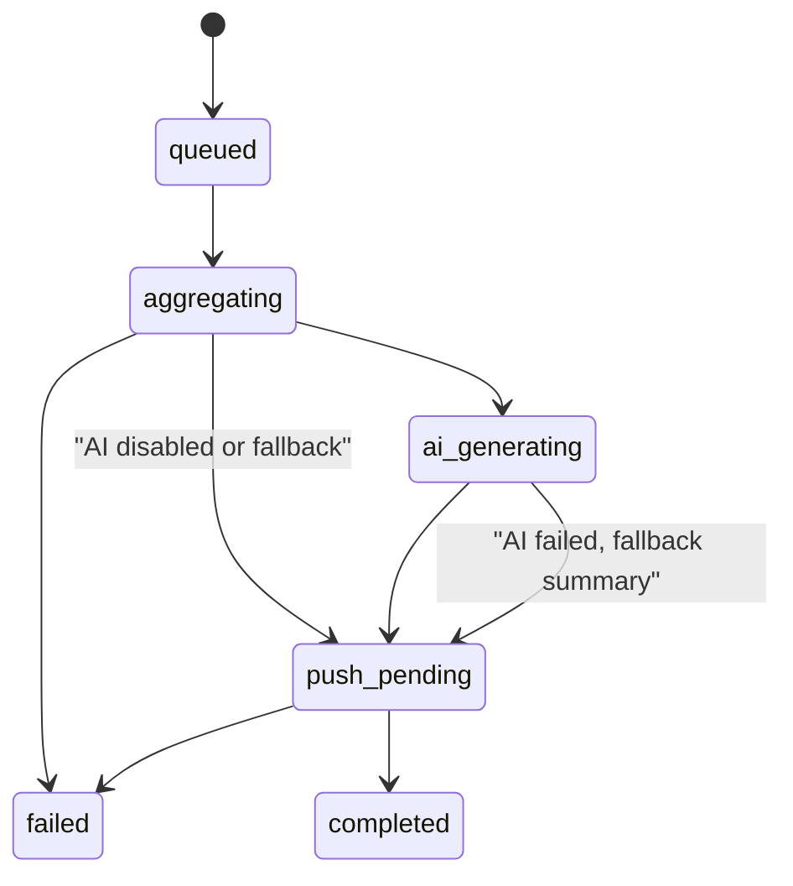

# 共享生活 Dashboard 小程序 - 工程实现计划

## 文档信息
- 来源设计稿: `~/.gstack/projects/personal/ma_yunfei-unknown-design-20260328-165354.md`
- 当前仓库状态: 原型期，页面以 mock data 为主，尚未形成真实共享数据层
- 当前分支: `unknown`
- 目标: 把已批准的产品设计压成可实现、可拆分、可测试的工程计划

## 工程结论
这次不是在旧产品上补功能，而是在现有原型壳上重建一个新的数据骨架。

当前代码里，`pages/home/home.js`、`pages/timeline/timeline.js`、`pages/profile/profile.js` 都各自维护一份 mock 状态，页面之间没有统一的数据源，`cloudfunctions/openapi/index.js` 也还停在微信订阅消息示例层。这个状态反而是好事，因为真实数据还没落地，迁移成本低，不需要背历史包袱。

**工程建议**:
- 保留 `home` 和 `profile` 的页面路径，避免把改动浪费在重命名上
- 新增 `records` 和 `reports` 页面，直接落新信息架构
- 从一开始建立共享领域模型，不再让每个页面各自拼 mock 数据
- 把 V1 明确拆成 `V1a 核心产品` 和 `V1b 报告层`，不要把 AI 和推送绑死在首批交付里

## 当前代码现状

### 已有页面
- `pages/home/home`: 首页壳已存在，但内容仍围绕待办、纪念日、照片
- `pages/timeline/timeline`: 旧时间线页，逻辑和文案都不适合继续做一级导航
- `pages/photos/photos`: 旧照片页，V1 不应再作为主路径
- `pages/profile/profile`: 可改造成 `我们`
- `pages/index/index`: 目前更像临时跳转/表单页，后续可收缩为内部表单承载页或移除

### 已有数据层问题
- 所有页面都直接读取 `app.globalData` 或本地 mock 数据
- 没有统一的服务层，也没有页面聚合层
- 没有真实的情侣空间权限模型
- 没有可复用的时间边界规则
- 订阅消息能力只有 demo，没有业务状态机

## 目标架构

### 页面信息架构
- `pages/home/home` -> `首页`
- `pages/records/records` -> `记录`
- `pages/reports/reports` -> `报告`
- `pages/profile/profile` -> `我们`

### 旧页面处理
- `pages/timeline/timeline`: 从 tabBar 移除，保留为短期兼容壳，默认跳转到 `首页` 的最近动态区
- `pages/photos/photos`: 从 tabBar 移除，V1 不再承载核心能力，可保留占位页避免历史入口硬报错

### 前端目录建议
```text
miniprogram/
├── app.js
├── app.json
├── services/
│   ├── auth.js
│   ├── couple.js
│   ├── expenses.js
│   ├── todos.js
│   ├── anniversaries.js
│   ├── dashboard.js
│   ├── reports.js
│   └── subscriptions.js
├── stores/
│   ├── session-store.js
│   └── ui-store.js
├── utils/
│   ├── date.js
│   ├── format.js
│   ├── enums.js
│   └── guards.js
├── pages/
│   ├── home/
│   ├── records/
│   ├── reports/
│   ├── profile/
│   ├── timeline/
│   ├── photos/
│   └── index/
└── components/
    ├── dashboard-card/
    ├── quick-action-bar/
    ├── expense-form/
    ├── todo-form/
    ├── anniversary-form/
    ├── report-summary-card/
    └── activity-feed/
```

### 设计原则
1. 页面只负责展示和交互，不直接拼接数据库查询。
2. 领域逻辑放在 `services/`，时间规则放在 `utils/date.js`。
3. `首页` 和 `报告` 不直接读散表，统一走聚合接口。
4. AI 只吃结构化快照，不碰原始散乱记录。
5. 所有周期计算统一按 `Asia/Shanghai` 执行。

## 关键工程决策

### 1. `single` 状态在 V1 不做草稿迁移
这件事如果不收住，会把整个产品拖进另一套本地草稿合并逻辑。

V1 规则:
- 用户未配对时，只能完成登录、创建空间、加入空间、设置通知偏好
- 不做持久化的个人草稿记录
- `记录` 页在 `single` 状态显示只读引导和 CTA，不显示可提交表单

这能直接砍掉草稿提升、冲突合并、归属重映射三件脏活。

### 2. 记账归属不要用 `me / partner / shared` 作为底层枚举
这个看起来顺手，实际很危险，因为 `me` 对两个人来说不是同一个值。

**底层建议**:
- `ownerScope`: `shared` | `personal`
- `ownerUserId`: `string | null`

**UI 映射**:
- `ownerScope = shared` -> `共同`
- `ownerScope = personal` 且 `ownerUserId === currentUserId` -> `我`
- `ownerScope = personal` 且 `ownerUserId !== currentUserId` -> `伴侣`

这样首页、报告、权限判断都不会因为视角不同而乱掉。

### 3. 首页默认周视角
首页是“最近怎么样”，不是“这个月会计结算”。

V1 规则:
- 首页主卡默认显示本周支出
- 卡片副信息展示与上周对比
- 月度信息进入 `报告 > 月报`

### 4. 最近动态只保留轻量事实流
不要把旧时间线的叙事包袱重新请回来。

V1 规则:
- 类型仅保留: `expense_created`、`todo_created`、`todo_completed`、`anniversary_created`、`report_generated`
- 排序: `createdAt desc`
- 保留策略: 最近 30 天或最新 50 条，取较小集合

### 5. 周期边界一次定死
不然后面首页、报告、推送三个地方会算出三个答案。

V1 统一规则:
- 时区: `Asia/Shanghai`
- 周周期: 周一 00:00:00 到周日 23:59:59
- 月周期: 自然月
- 编辑锁定: 记录创建后 24 小时内允许原创建者改金额，超时后只能补备注

## 数据模型

### `users`
```js
{
  _id,
  openId,
  nickName,
  avatarUrl,
  timezone: "Asia/Shanghai",
  createdAt,
  updatedAt
}
```

### `couples`
```js
{
  _id,
  creatorUserId,
  partnerUserId: null,
  status: "invited" | "paired",
  inviteCodeHash,
  inviteExpiresAt,
  weekStartsOn: 1,
  timezone: "Asia/Shanghai",
  createdAt,
  pairedAt: null,
  updatedAt
}
```

说明:
- `single` 是用户态，不是 `couples.status`
- 一旦配对成功，邀请码立即失效

### `expenses`
```js
{
  _id,
  coupleId,
  amountCents,
  currency: "CNY",
  categoryKey,
  ownerScope: "shared" | "personal",
  ownerUserId: null | "user_xxx",
  note,
  occurredOn,       // YYYY-MM-DD
  createdBy,
  createdAt,
  updatedAt,
  editLockedAt      // createdAt + 24h
}
```

### `todos`
```js
{
  _id,
  coupleId,
  title,
  note,
  assigneeUserId: null | "user_xxx",
  dueAt: null,
  status: "open" | "completed",
  completedBy: null | "user_xxx",
  completedAt: null,
  createdBy,
  createdAt,
  updatedAt
}
```

### `anniversaries`
```js
{
  _id,
  coupleId,
  title,
  date,             // YYYY-MM-DD
  type: "custom" | "birthday" | "relationship",
  linkedTodoId: null | "todo_xxx",
  note,
  createdBy,
  createdAt,
  updatedAt
}
```

### `activity_feed`
```js
{
  _id,
  coupleId,
  type,
  actorUserId,
  targetType,
  targetId,
  summary,
  createdAt
}
```

### `report_snapshots`
```js
{
  _id,
  snapshotKey,      // coupleId:periodType:periodStart
  coupleId,
  periodType: "weekly" | "monthly",
  periodStart,
  periodEnd,
  comparePeriodStart,
  comparePeriodEnd,
  status: "pending" | "ready_no_ai" | "ready" | "failed",
  metrics,
  aiSummary: null | {
    headline,
    summary,
    suggestions
  },
  failureReason: null,
  generatedAt,
  pushedAt: null
}
```

### `report_runs`
```js
{
  _id,
  snapshotKey,
  coupleId,
  periodType,
  status: "queued" | "aggregating" | "ai_generating" | "push_pending" | "completed" | "failed",
  startedAt,
  finishedAt: null,
  errorMessage: null
}
```

### `report_subscriptions`
```js
{
  _id,
  coupleId,
  userId,
  weeklyEnabled: true,
  monthlyEnabled: true,
  templateId,
  lastConsentAt,
  updatedAt
}
```

## 云函数拆分

### 推荐拆法
- `login`
  - 继续保留，用于用户登录上下文初始化
- `couple`
  - `createSpace`
  - `joinSpace`
  - `getSpaceState`
  - `leaveSpace`，如果 V1 需要
- `records`
  - `listExpenses`
  - `createExpense`
  - `updateExpense`
  - `listTodos`
  - `createTodo`
  - `updateTodo`
  - `completeTodo`
  - `listAnniversaries`
  - `createAnniversary`
  - `updateAnniversary`
- `dashboard`
  - `getHomeDashboard`
  - `listRecentActivity`
- `reports`
  - `listReports`
  - `getReportDetail`
  - `generateReportSnapshot`
- `messaging`
  - 从当前 `openapi` 演进而来
  - `requestSubscriptionTemplate`
  - `sendReportNotification`

### 为什么这么拆
- 比“一切都塞进一个巨型云函数”更容易维护
- 比“每个动作一个云函数”更少样板代码
- 适合现在这个项目规模

## 前端服务层职责

### `services/couple.js`
- 获取当前用户的空间状态
- 返回标准化的 `single / invited / paired` 视图态

### `services/expenses.js`
- 处理表单入参
- 金额转换为 `amountCents`
- 映射 `我 / 伴侣 / 共同` 到底层归属模型

### `services/dashboard.js`
- 调 `dashboard.getHomeDashboard`
- 组装首页卡片展示字段
- 兜底首个周期和空状态文案

### `services/reports.js`
- 获取周报/月报列表与详情
- 把 `ready_no_ai` 映射成可读报告
- 统一报告错误态文案

## 首页聚合接口

### `dashboard.getHomeDashboard` 返回建议
```js
{
  pairState: "single" | "invited" | "paired",
  spendCard: {
    periodType: "weekly",
    totalCents,
    compareTotalCents: null,
    compareDeltaPct: null,
    label
  },
  todoCard: {
    total,
    completed,
    overdue,
    dueSoon
  },
  anniversaryCard: {
    upcomingCount,
    nextAnniversary: null | {
      id,
      title,
      date,
      daysLeft
    }
  },
  reportCard: {
    weeklyStatus: "not_generated" | "generating" | "ready" | "failed",
    monthlyStatus: "not_generated" | "generating" | "ready" | "failed",
    nextScheduledAt
  },
  quickActions: ["expense", "todo", "anniversary"],
  activityFeed: []
}
```

## 报告生成流水线

### 为什么要分两层
报告不是页面渲染时顺手算一下就结束了。你还要复用给推送、历史查看、失败重试。

所以需要两层对象:
- `report_runs` 负责运行时状态
- `report_snapshots` 负责最终可读结果

### 状态机


### 运行规则
1. 定时任务按周期生成 `snapshotKey`
2. 若存在 `ready` 或 `ready_no_ai` 的 snapshot，直接退出，保证幂等
3. 若存在失败记录，可重试并覆盖失败态
4. 先聚合 deterministic metrics
5. 再调用 AI 生成标题、摘要、建议
6. AI 失败时写入 fallback summary，不阻塞报告上线
7. 只有 snapshot 可读后，才进入推送阶段

### 快照不可变规则
- `ready` 和 `ready_no_ai` 的 snapshot 在 V1 视为不可变
- 定时任务不会重算已完成 snapshot
- 如果未来需要后台修复，走管理员 backfill 脚本，不在 V1 产品流程内暴露

这样历史报告不会今天一个答案，明天又变。

## 推送设计

### 默认节奏
- 周报: 每周日 20:30
- 月报: 每月最后一天 20:30

### 推送条件
- 订阅已授权
- 对应 snapshot 状态为 `ready` 或 `ready_no_ai`
- 本周期尚未对该用户发送过

### 推送内容
- 1 条结论
- 1 到 2 个数字
- 深链到 `pages/reports/reports?periodType=weekly&periodStart=YYYY-MM-DD`

## V1 实现拆分

### V1a, 先把产品活起来
1. 改 tabBar 到 `首页 / 记录 / 报告 / 我们`
2. 新建 `pages/records/records`
3. 新建 `pages/reports/reports`
4. 改 `home` 为 dashboard
5. 改 `profile` 为关系与设置
6. 建 `couples / expenses / todos / anniversaries / activity_feed` 集合
7. 建前端服务层和统一日期工具
8. 完成费用、待办、纪念日 CRUD
9. 完成首页聚合接口

### V1b, 再把复盘层补上
1. 建 `report_snapshots / report_runs / report_subscriptions`
2. 写周报/月报聚合逻辑
3. 接入 AI 解释层
4. 接入订阅消息发送
5. 落历史报告列表和详情页

## 旧页面迁移步骤
1. 修改 `app.json`，加入 `records` 和 `reports`
2. 把 `timeline`、`photos` 移出 tabBar
3. 先保留旧页面文件，减少跳转报错
4. 给 `timeline` 加兼容跳转逻辑
5. 等新首页最近动态稳定后，再决定彻底移除 `timeline`

## 风险和控制

### 风险 1: 首页和报告各算各的
控制:
- 一切周期边界由 `utils/date.js` 统一输出
- 首页对比和报告对比共用同一套 period helper

### 风险 2: 个人归属模型做错后期很难救
控制:
- 不用相对枚举 `me / partner`
- 直接落 `ownerScope + ownerUserId`

### 风险 3: AI 让报告变得不稳定
控制:
- AI 不碰原始数据
- AI 失败不影响 snapshot 可读
- 历史 snapshot 完成后不重写

### 风险 4: V1 范围膨胀
控制:
- 自定义区间报告放到 V1.1
- 预算提醒放到 V1.1
- 照片不回主路径

## 测试计划

### 单元测试
- `utils/date.js`: 周期边界、时区、首个周期兜底
- `services/expenses.js`: 金额转换、归属映射、表单校验
- `services/reports.js`: 状态映射、fallback summary 处理

### 集成测试
- `single -> invited -> paired` 空间流转
- 记一笔后首页卡片即时刷新
- 新增待办后最近动态可见
- 纪念日进入 14 天窗口后首页提醒可见
- 周报生成成功后列表和详情一致
- AI 失败时报告仍可读

### 手工回归
- tabBar 切换
- 记录页三个分段切换
- 首个周期无对比数据时的展示
- 创建 24 小时后费用编辑锁生效
- 周报推送点击回流到正确报告

## 最先动手的文件
- `miniprogram/app.json`
- `miniprogram/pages/home/home.js`
- `miniprogram/pages/home/home.wxml`
- `miniprogram/pages/profile/profile.js`
- `miniprogram/pages/profile/profile.wxml`
- `miniprogram/pages/records/*`
- `miniprogram/pages/reports/*`
- `miniprogram/services/*`
- `cloudfunctions/couple/*`
- `cloudfunctions/records/*`
- `cloudfunctions/dashboard/*`
- `cloudfunctions/reports/*`
- `cloudfunctions/openapi/*` 或新的 `cloudfunctions/messaging/*`

## 推荐执行顺序
1. 先改导航和页面壳
2. 再建服务层和日期规则
3. 接着落 `expenses / todos / anniversaries / activity_feed`
4. 然后做首页聚合
5. 最后做报告快照、AI、推送

这顺序很重要。先把“记录事实 -> 首页看到”打通，产品就活了。报告和 AI 是第二阶段放大器，不是第一阶段地基。
